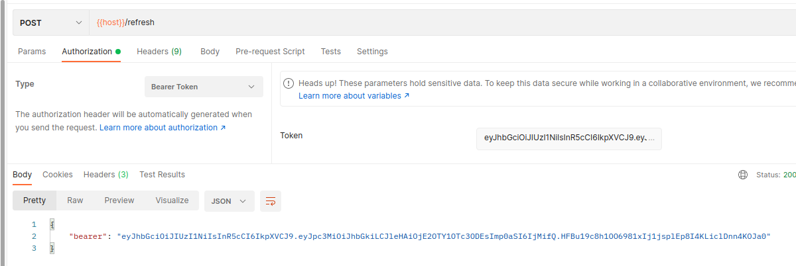
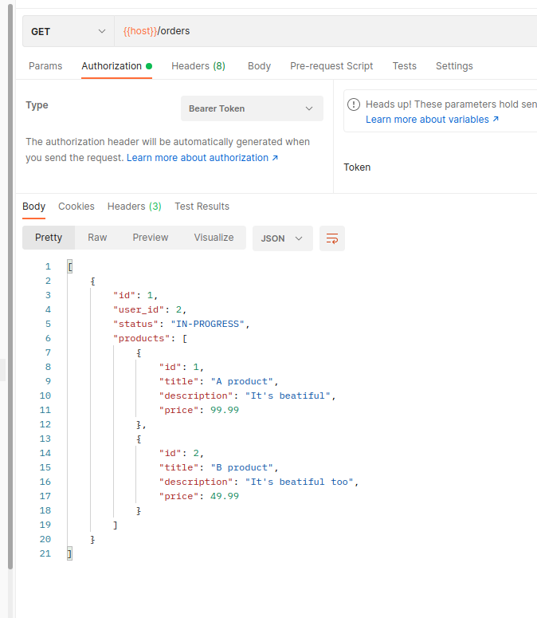

# Real-time Notifications with NATS and Go

A repository showcasing the implementation of real-time notifications using NATS messaging system and the Go programming language. Learn how to build responsive applications with instant notifications.

## Project Overview

Welcome to the Real-time Notifications with NATS and Go repository! In this project, we'll explore the implementation of real-time notifications using the NATS messaging system and the Go programming language. By building this application, you'll gain valuable insights into creating responsive and engaging applications with instant notifications.

The primary objective of this project is to demonstrate how to utilize the NATS messaging system to enable real-time notifications in a Go-based application. We'll explore how to set up event communication, publish and subscribe to events, and integrate this functionality into a responsive user interface.

## Features

- **Real-time Event Communication:** Implement a robust event-driven architecture using NATS to facilitate instant communication between application components.
- **User Activity Tracking:** Showcase the tracking of user activities as events, and generate real-time notifications for relevant actions.
- **Subscription Management:** Allow users to subscribe to specific event types and receive immediate updates when those events occur.

## Technologies Used

- **NATS:** The core messaging system that enables real-time event communication between application components.
- **Go:** Utilize the Go programming language to build the backend server, handle event processing, and manage real-time notifications.

## Getting Started

Follow these steps to set up and run the project on your local machine:

- Clone the Repository: Begin by cloning this repository to your local machine.

```bash
git clone https://github.com/BaseMax/real-time-notifications-nats-go.git
cd real-time-notifications-nats-go
```

Backend Setup: Navigate to the backend directory and install the required dependencies.

```bash
cd backend
go mod download
```

Start the Backend: In the backend directory, start the Go server.

```bash
go run main.go
```

Access the Application: Open your web browser and visit `http://localhost:8080` to access the real-time notifications application.

## Contribution Guidelines

Contributions to this repository are encouraged! To contribute, please follow these steps:

- Fork the repository to your GitHub account.
- Create a new branch for your feature or bug fix.
- Implement your changes and commit them with informative commit messages.
- Push your branch to your forked repository.
- Create a pull request from your branch to the main branch of this repository.

## Endpoints

| Endpoint | Method | Postman |
| --- | ---- | ---- |
| /register | POST |  |
| /login | POST |  |
| /refresh | POST |  |
| /users/:id | GET |  |
| /users | GET |  |
| /users/:id | DELETE |  |
| /users/:id | PUT |  |
| /notifications | raw |  |
| /activities | GET |  |
| /activities/seen | POST |  |
| /products | POST |  |
| /products/:id | GET |  |
| /products | GET |  |
| /products/:id | PUT |  |
| /products/:id | DELETE |  |
| /orders | POST |  |
| /orders/:id | GET |  |
| /orders | GET |  |
| /orders/:id | DELETE |  |
| /orders/:id/status | GET |  |
| /orders/first | GET |  |
| /orders/first/done | POST |  |
| /orders/first/cancel | POST |  |
| /refunds/:order_id | POST |  |
| /refunds/:id | GET |  |
| /refunds | GET |  |
| /refunds/:id | DELETE |  |
| /refunds/:id/statys | GET |  |
| /refunds/:id/cancel | POST |  |
| /refunds/first | GET |  |
| /refunds/first/done | POST |  |
| /refunds/first/cancel | POST |  |


## Database and Schema Design

In the Real-time Notifications with NATS and Go project, the database and schema play a vital role in managing user activities, events, and preferences. An effective schema design ensures efficient data storage and retrieval, while accommodating the requirements of real-time notifications.

### Database Technology

For this project, we'll use a relational database to store user activities and event data. PostgreSQL, a powerful open-source relational database system, can be an excellent choice due to its robust features and support for complex queries.

### Event Data

The event_data field in the activities table will hold the specific data associated with each event. For example, when a user completes a task, the event_data field could store information like task ID, task title, and completion status.

### Subscription Preferences

The subscription_preferences field in the users table will hold user preferences for event subscriptions. This can be structured as a JSON object where each event type maps to a subscription status (e.g., true for subscribed, false for unsubscribed). This allows users to customize which events they want to receive notifications for.

## Integration with NATS

The events stored in the database can be published to the NATS messaging system whenever an activity occurs. Subscribers can then listen to these events and generate real-time notifications based on user preferences.

## Conclusion

A well-designed database schema is a crucial foundation for capturing and managing user activities and events in the context of real-time notifications. By utilizing PostgreSQL and structuring the schema effectively, you'll be able to seamlessly integrate event sourcing and real-time notifications into your application.

Feel free to adjust the schema according to your specific requirements and preferences. Always ensure your schema supports efficient queries and data retrieval while accommodating the real-time nature of your project.

## License

This project is licensed under the GPL-3.0 License.

Copyright 2023, Max Base
